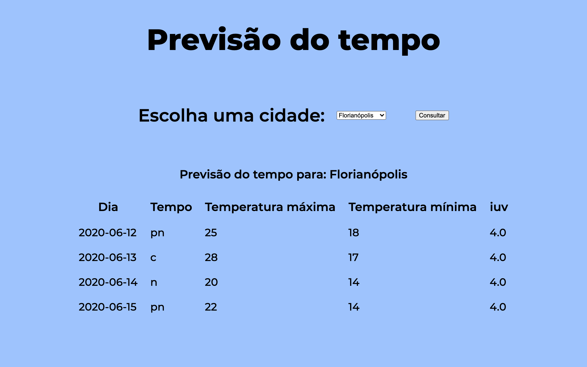
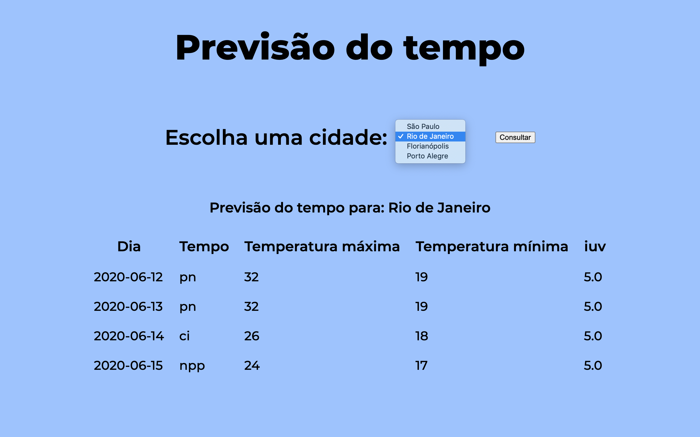

# programacao_web
Pasta para os exercícios da disciplina programação web

App de uma página com os dados de um café.

Atividade desenvolvida durante o curso da Udacity - Android Basics, concluído em 05/05/2019.

# udacity-android-cafe-deli

App de uma página com os dados de um café.

Atividade desenvolvida durante o curso da Udacity - Android Basics, concluído em 05/05/2019.

  

 

  

